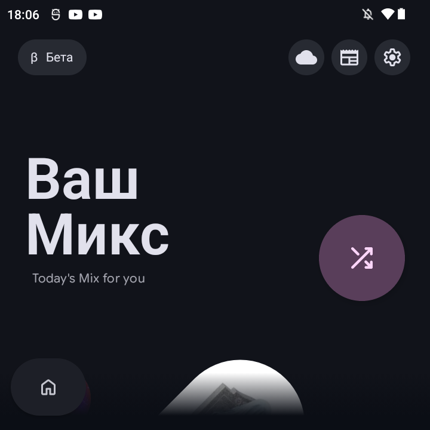
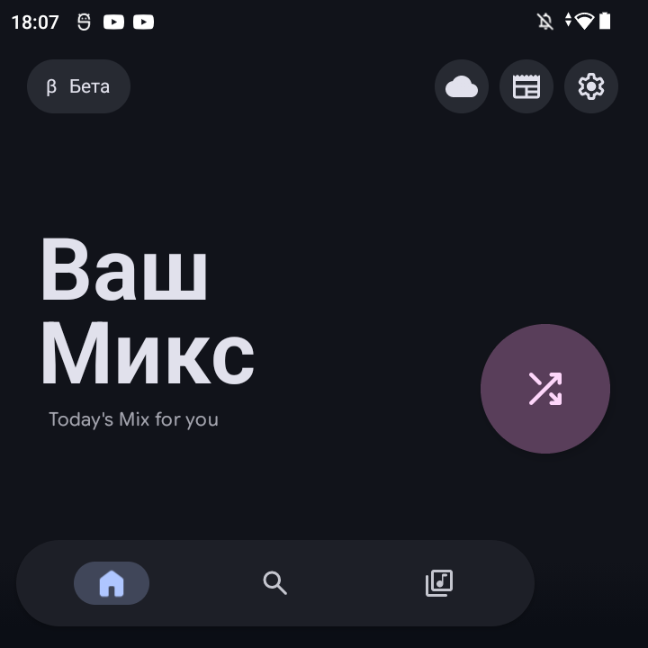
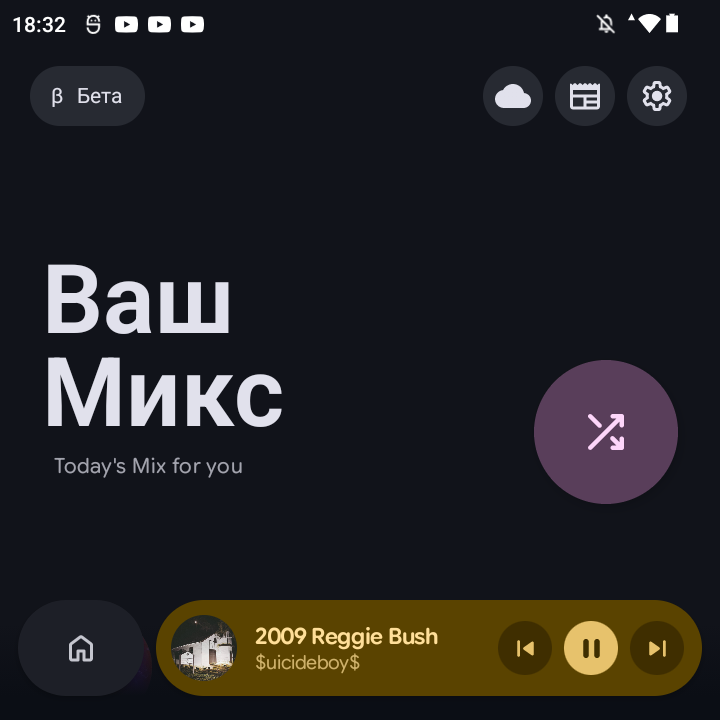
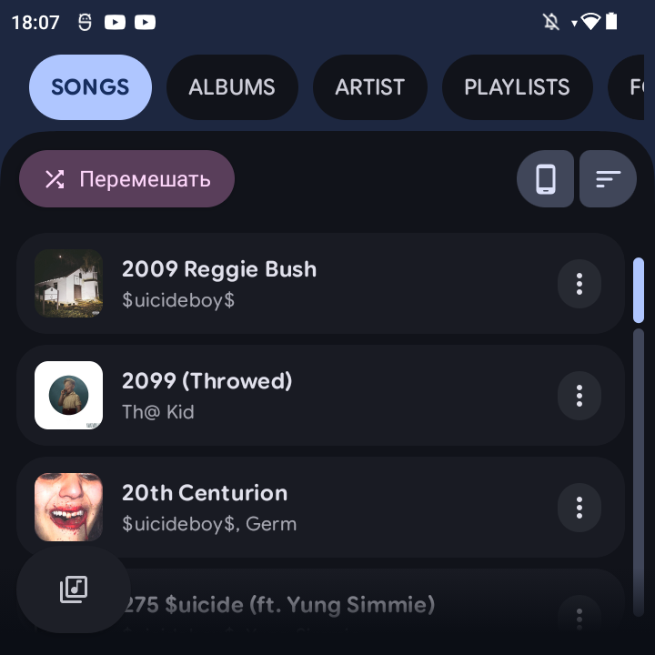
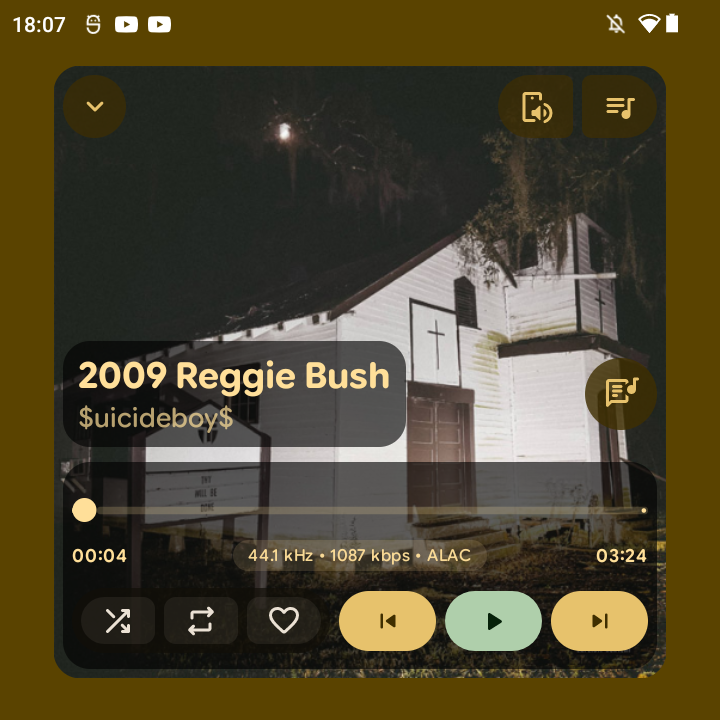
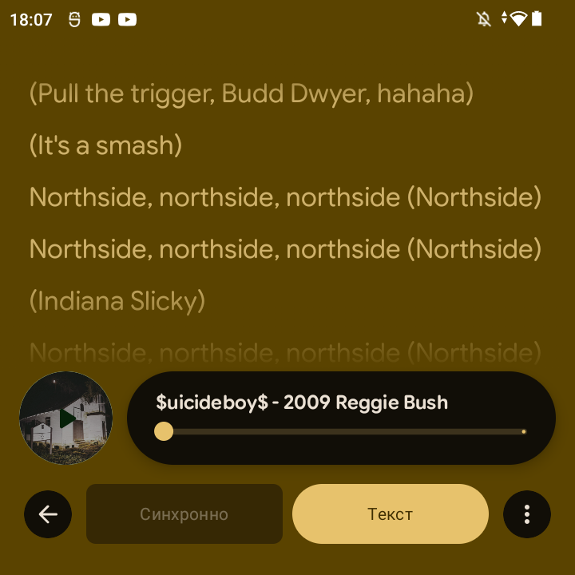
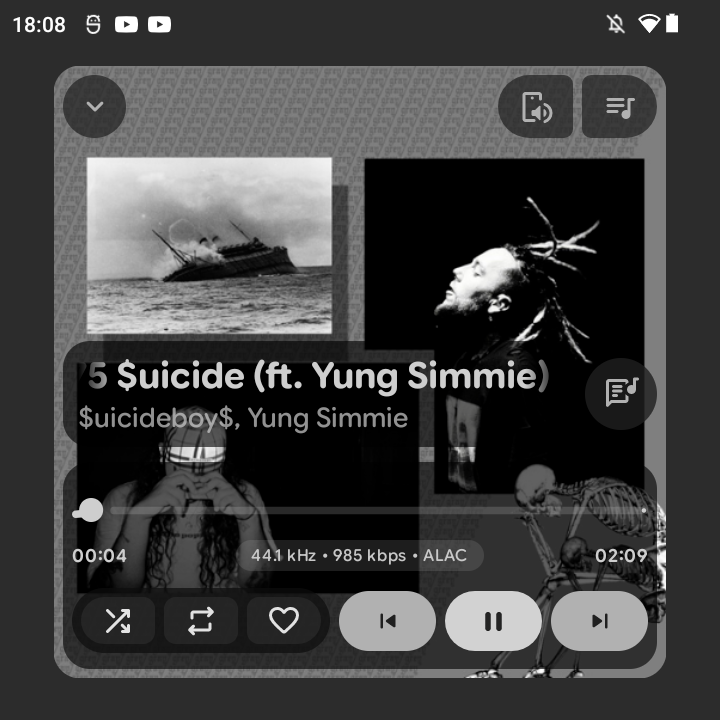
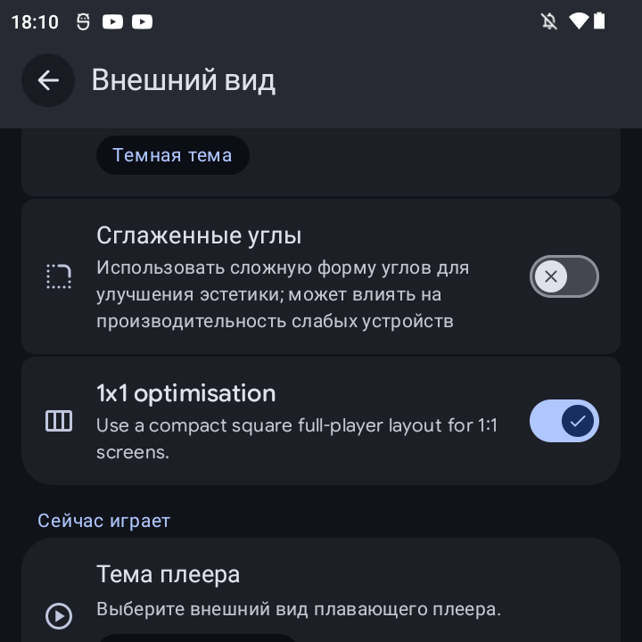

# PixelPlayer 🎵

  

  <strong>A beautiful, feature-rich music player for Android</strong> 
  Built with Jetpack Compose and Material Design 3

  
  
  
  
  
  
  
  

---

## ‼️ Disclaimer

This repository is an unofficial fork of the original  
[theovilardo/PixelPlayer](https://github.com/theovilardo/PixelPlayer).

The original project is created and maintained by  
[theovilardo](https://github.com/theovilardo).

This fork is not officially supported by the original developer.  
For issues related to this fork, please use this repository instead of contacting the upstream maintainer.

This fork is made specifically for the Anbernic RG Rotate.

Tested only on the Anbernic RG Rotate and only with the Russian language enabled.

---

## ✨ Fork Features

This fork adds a set of interface optimizations for the Anbernic RG Rotate.

### 1:1 Display Optimizations

- Dedicated `1x1 optimisation` toggle in Appearance settings.
- Optimized full player layout for the Anbernic RG Rotate display.
- Album artwork used as the main visual background in the fullscreen player.
- Compact fullscreen player controls designed for limited vertical space.
- Optimized lyrics screen layout for the RG Rotate screen.

### Compact Bottom bar

- Navigation bar and mini player share one bottom row.
- Collapsed navigation bar shows only the active section icon.
- Mini player expands into the remaining horizontal space.
- Tapping the navigation icon expands the nav bar while compacting the mini player to album art.
- Consistent rounded corners between nav bar and mini player.

### Library Screen Adjustments

- Library tab carousel can replace the large title area on optimized screens.
- Settings button can be hidden from the Library top bar in optimized mode.
- Reduced vertical space usage at the top of the Library screen.

### Lyrics Screen Improvements

- Track title and artist are shown inside the playback progress block.
- Long track metadata uses marquee scrolling.
- The play/pause button can use rotating album artwork as its background.
- Lyrics-related dialogs and sort menus are scrollable where needed on compact displays.

## 📄 License

All rights reserved by <a href="https://github.com/theovilardo">theovilardo</a>.

This project is licensed under a Proprietary License - see the [LICENSE](LICENSE) file for details.

---

  Original developer <a href="https://github.com/theovilardo">theovilardo</a>

